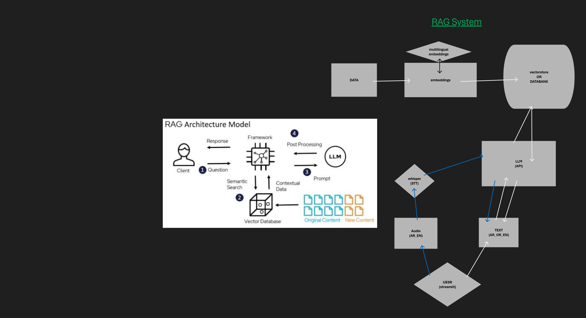

# 🤖 AI Technical Assistant (Voice-Enabled RAG)

An advanced **Retrieval-Augmented Generation (RAG)** assistant that understands both **Arabic and English**. This system allows users to interact with their private documents through **Text** or **Voice**, ensuring highly accurate and context-specific answers.
## 📺 Project Demo


https://youtu.be/bP3gkUH-N-c


> "This is not just a story, this is our future" 🚀

## 🚀 Key Features
* **🎙️ Multimodal Input:** Support for real-time voice recording (STT) and text input.
* **🌍 Multilingual Support:** Uses `multilingual-e5-large` for seamless Arabic/English document processing.
* **⚡ Fast Transcription:** Powered by `Faster-Whisper (Turbo)` for near-instant voice-to-text.
* **🧠 Precise RAG:** Strictly limited to provided context to prevent hallucinations.
* **💻 Modern UI:** Clean Streamlit interface with full **RTL (Right-to-Left)** support for Arabic users.
* **🚀 High Performance:** Uses **Groq API** for ultra-fast LLM responses (Llama-3.3-70b).


## 📊 Workflow Diagram



  
## 🛠️ Tech Stack
- **Frontend:** Streamlit
- **STT (Speech-to-Text):** Faster-Whisper
- **Orchestration:** LangChain
- **Vector Database:** FAISS
- **Embeddings:** HuggingFace (E5-Large)
- **LLM API:** Groq (Llama-3.3)

## 🔧 Installation & Setup
1. Clone the repo:
   ```bash
   git clone https://github.com/lilosman/RAG_System.git

# 2. Navigate to the project directory
cd RAG_System

# 3. Install requirements
pip install -r requirements.txt

# 4. Create a .env file and add your API Key
echo "GROQ_API_KEY=your_key_here" > .env

# 5. Run the application
streamlit run app.py   
